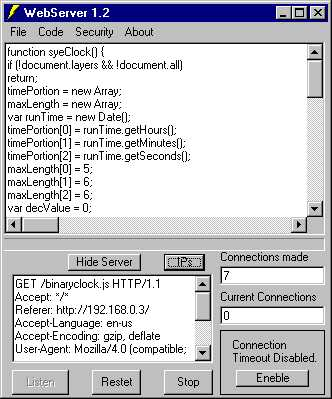



## Advanced WebServer

### Description

This advanced webserver does downloads, hit counter, IP logger, IP blocker, /..(back directory) protection, custom 404 errors, and even lets you send a personal message to the client computer instead of the HTML document they requested. It also lets you chose how many winsock controls are to be loaded...Very simple to run, just give it the path to your HTML index file Ex: "C:\html\index.php" Then press "Listen" and give people your IP address in this format, "Http://192.168.0.3" Please give me pleany of fedback and make sure you vote!
 
### More Info
 

             |
---                |---
**Submitted On**   |2001-08-22 00:34:28
**By**             |[Micah Lansing](https://github.com/Planet-Source-Code/PSCIndex/blob/master/ByAuthor/micah-lansing.md)
**Level**          |Intermediate
**User Rating**    |4.9 (97 globes from 20 users)
**Compatibility**  |VB 5\.0, VB 6\.0
**Category**       |[Complete Applications](https://github.com/Planet-Source-Code/PSCIndex/blob/master/ByCategory/complete-applications__1-27.md)
**World**          |[Visual Basic](https://github.com/Planet-Source-Code/PSCIndex/blob/master/ByWorld/visual-basic.md)
**Archive File**   |[Advanced W250988222001\.zip](https://github.com/Planet-Source-Code/micah-lansing-advanced-webserver__1-25913/archive/master.zip)

